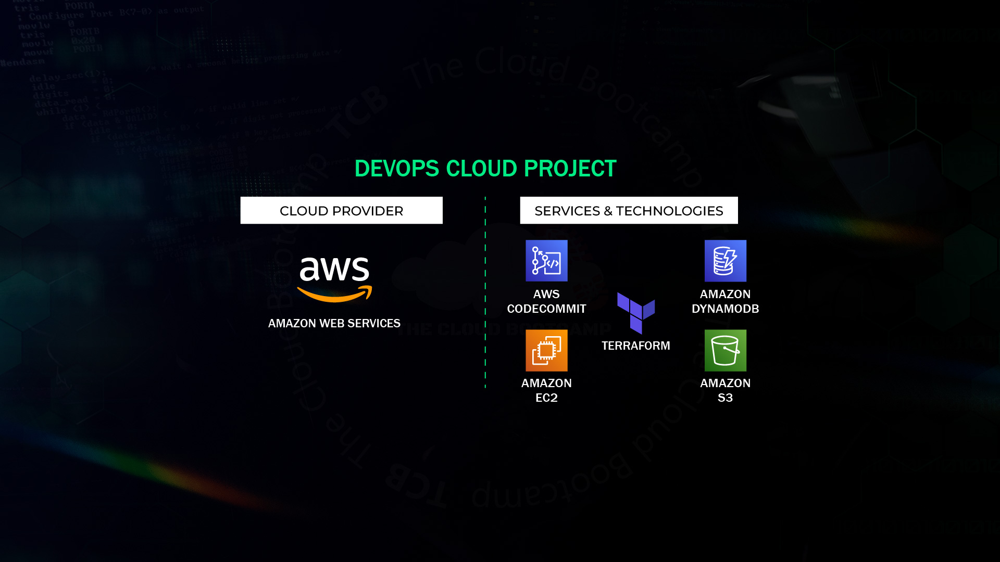

# HumanGov Infrastructure

HumanGov: Deployment Of A Reusable Saas Multi-tenant AWS Infrastructure Using Terraform Modules Securely Storing Terraform Configuration Files On AWS Code Commit.

### Description:

In this project based on a real-world scenario, I designed and deployed a reusable, multi-tenant SaaS infrastructure on AWS using Terraform modules. The infrastructure was based on AWS services such as EC2 instances, DynamoDB databases and S3 buckets. 

